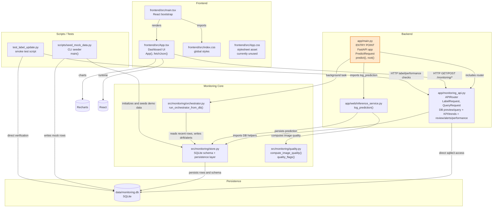

# Code-Level Architecture

## Mermaid Diagram

## Summary Table

| Module | Responsibility | Depends On | Exposed Functions |
|---|---|---|---|
| [app/main.py](app/main.py) | FastAPI application entrypoint; wires CORS, monitoring router, prediction ingestion, and orchestrator trigger | [app/monitoring_api.py](app/monitoring_api.py), [app/web/inference_service.py](app/web/inference_service.py), [src/monitoring/orchestrator.py](src/monitoring/orchestrator.py) | predict(), root() |
| [app/monitoring_api.py](app/monitoring_api.py) | Monitoring API router for KPI, trends, review queue, alerts, performance summaries, DB preview, and SQL query execution | [src/monitoring/store.py](src/monitoring/store.py), sqlite3 | db_web_preview(), db_query(), get_kpi(), confidence_trend(), class_ratio(), drift_trend(), review_queue(), submit_label(), get_alerts(), resolve_alert_endpoint(), perf_over_time(), perf_summary(); _is_read_only_query() and _run_sql_query() are internal |
| [app/web/inference_service.py](app/web/inference_service.py) | Adapts incoming model predictions into stored monitoring events | [src/monitoring/store.py](src/monitoring/store.py), [src/monitoring/quality.py](src/monitoring/quality.py) | log_prediction() |
| [src/monitoring/store.py](src/monitoring/store.py) | SQLite persistence layer and schema management for predictions, feedback, drift events, and alerts | [data/monitoring.db](data/monitoring.db), sqlite3 | init_db(), insert_prediction(), fetch_rows(), count_rows(), fetch_recent_predictions(), insert_drift_event(), recent_hours(), upsert_alert(), resolve_alert() |
| [src/monitoring/orchestrator.py](src/monitoring/orchestrator.py) | Batch drift detection and alert generation from recent database windows | [src/monitoring/store.py](src/monitoring/store.py) | run_orchestrator_from_db(); _quality_issue_ratio() and _class_drift_score() are internal |
| [src/monitoring/quality.py](src/monitoring/quality.py) | Image-quality feature extraction and quality warnings | None | compute_image_quality(), quality_flags() |
| [scripts/seed_mock_data.py](scripts/seed_mock_data.py) | CLI script that seeds realistic demo data into the SQLite database | [src/monitoring/store.py](src/monitoring/store.py) | main(), seed_predictions(), seed_feedback(), seed_drift_events(), seed_alerts(); helper utilities are internal |
| [frontend/src/main.tsx](frontend/src/main.tsx) | React bootstrap and application mount point | [frontend/src/App.tsx](frontend/src/App.tsx), [frontend/src/index.css](frontend/src/index.css), ReactDOM | entry bootstrap only |
| [frontend/src/App.tsx](frontend/src/App.tsx) | Main dashboard UI, API polling, alert resolution, pagination, and chart rendering | [app/main.py](app/main.py) via HTTP, React, Recharts | App(); fetchJson(), formatPercent(), formatNumber() are internal |
| [frontend/src/index.css](frontend/src/index.css) | Global frontend styling | [frontend/src/main.tsx](frontend/src/main.tsx) | None |
| [frontend/src/App.css](frontend/src/App.css) | Standalone stylesheet asset in the repo | None; currently not imported by the runtime path | None |
| [test_label_update.py](test_label_update.py) | Smoke test for review-queue labeling and downstream metric checks | [app/monitoring_api.py](app/monitoring_api.py) via HTTP, [data/monitoring.db](data/monitoring.db) | script entrypoint only |

The system entry point is [app/main.py](app/main.py), which creates the FastAPI app and mounts the monitoring router. The frontend entry point is [frontend/src/main.tsx](frontend/src/main.tsx), which renders the dashboard App component.
